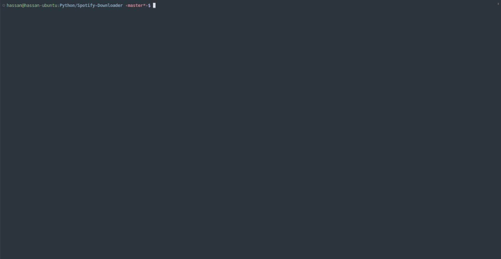

# Spotify Downloader
This is a small script that lets you download tracks and playlists from Spotify directly from the command line. See below for installation and usage instructions and examples.



## Installation
### Docker container (the recommended and easy way)
1. Clone this repository.
```console
git clone https://github.com/hassanaziz0012/spotify-downloader
```
2. cd into the directory and run the following commands:
```console
docker build -t spotify-downloader .
docker run -it -v your/music/folder:/app/music spotify-downloader
```

**NOTE:** Make sure to replace `"your/music/folder"` with the actual directory where you keep your music. This is used to sync playlists and ignore tracks that already exist.

### Compiling from source
1. Clone this repository.
```console
git clone https://github.com/hassanaziz0012/spotify-downloader
```
2. Install the required dependencies. This project needs [`ytfzf`](https://github.com/pystardust/ytfzf) and [`yt-dlp`](https://github.com/yt-dlp/yt-dlp) to work.
```console
# install python packages, including yt-dlp 
pip install -r requirements.txt 

# install ytfzf 
git clone https://github.com/pystardust/ytfzf 
cd ytfzf 
sudo make install doc
```

I recommend using Docker to install and run this script.

## Usage
1. Firstly, open `config.json` and set your Spotify client ID and client secret. You can get this after creating a developer app on Spotify: 
https://developer.spotify.com/dashboard/create
2. **If you installed via Docker**, then run the container using the following command: 
```console
docker run -it -v your/music/folder:/app/music spotify-downloader
```

Replace `your/music/folder` with your music directory. 

3. **If you installed from source**, then open `spotify-downloader.py` and change the `OUTPUT_DIR` variable's value to your music directory.

### Downloading a single track
```console
python spotify-downloader track {TRACK_ID}
```

### Downloading a playlist
```console
python spotify-downloader playlist {PLAYLIST_ID}
```

### Sync a playlist
```console
python spotify-downloader playlist {PLAYLIST_ID} -s
```

### Download a track with a custom YT url
```console
python spotify-downloader yt={YT_URL} track {TRACK_ID}
```

---
That's all, folks!